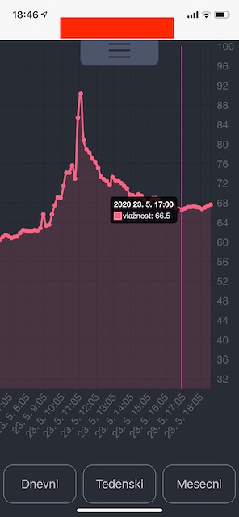
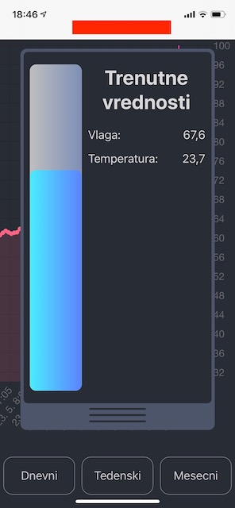
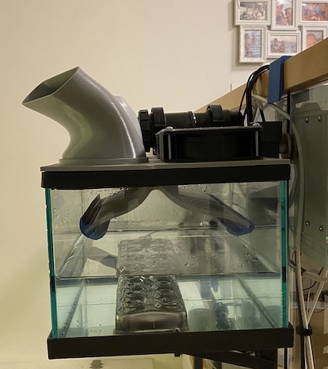
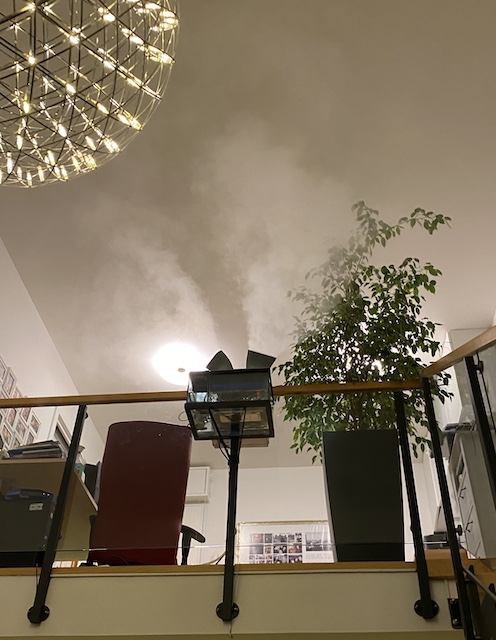

Home made humidifier with poweful output - this is the code for the User Interface.

1. React app                    <--- this is the code in this repo
2. Raspberry Pi Zero W - as the controller with hooked up DHT22 humidity and termperature sensor.
3. Custom electronics
4. Custom made hardware - glass humidifier with 3d printed cover and 24VDC fans carrying humidity in the living room.

